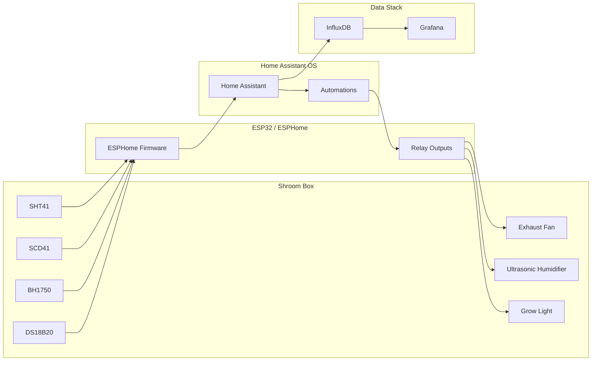

# Shroom Box Automation — Architecture

## Purpose

This project demonstrates a small controlled-environment automation system for oyster mushroom fruiting.

The goal is not to build a commercial grow controller, but to show a practical automation pipeline:

- environmental sensing
- Home Assistant integration
- time-series storage
- Grafana visualization
- basic climate control logic

## System Architecture

The project uses a single ESPHome configuration file (shroom-box-esp32.yaml) for the controller.

Configuration will not be split into multiple packages unless there is a demonstrated engineering need (for example, multiple controllers or substantial configuration reuse).

## Data Flow

1. ESP32 reads all environmental sensors.
2. ESPHome exposes measurements to Home Assistant.
3. Home Assistant stores selected entities in InfluxDB.
4. Grafana visualizes historical data.
5. Home Assistant controls relay outputs exposed by ESPHome.

## Control Strategy

| Parameter             | Source  | Action              |
| --------------------- | ------- | ------------------- |
| Air Temperature       | SHT41   | Monitoring          |
| Relative Humidity     | SHT41   | Humidifier control  |
| CO₂                   | SCD41   | Exhaust fan control |
| Light Level           | BH1750  | Compliance logging  |
| Substrate Temperature | DS18B20 | Monitoring          |

## Notes

- ESP32 directly controls all actuators through relay modules.
- Zigbee devices are not part of the system architecture.
- The humidifier is controlled through a relay and supports automatic recovery after power restoration.
- The exhaust fan provides fresh air exchange (FAE) and is not used for air circulation.
- The light sensor is used for compliance logging rather than active light control.