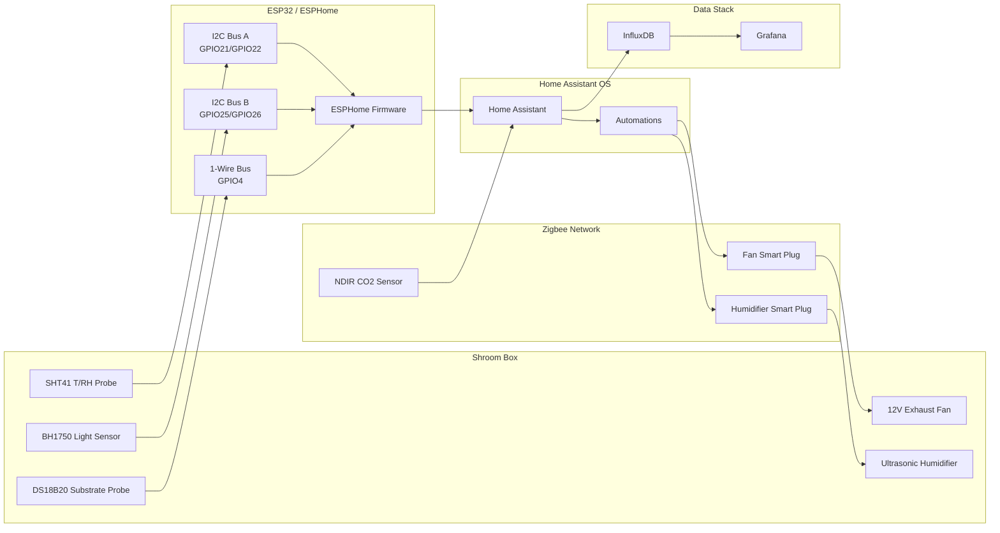

# Shroom Box Automation — Architecture

## Purpose

This project demonstrates a small controlled-environment automation system for oyster mushroom fruiting.

The goal is not to build a commercial grow controller, but to show a practical automation pipeline:

- environmental sensing
- Home Assistant integration
- time-series storage
- Grafana visualization
- basic climate control logic

## System Architecture

## Data Flow

1. ESP32 reads temperature, humidity, and light level.
2. CO2 is provided by a Zigbee NDIR sensor through Zigbee2MQTT/Home Assistant.
3. Home Assistant stores selected entities in InfluxDB.
4. Grafana visualizes the time-series data.
5. Home Assistant automations control fan and humidifier through Zigbee smart plugs.

## Control Strategy

| Parameter               | Source             | Action                               |
| ----------------------- | ------------------ | ------------------------------------ |
| Temperature (air)       | SHT41              | Monitoring only                      |
| Temperature (substrate) | DS18B20            | Monitoring only — substrate vs air delta |
| Relative humidity       | SHT41              | Humidifier control                   |
| CO₂                     | Zigbee NDIR sensor | Exhaust fan control                  |
| Light                   | BH1750             | Photoperiod compliance logging       |

## Notes

- The ESP32 does not directly switch high-power loads.
- Fan and humidifier are controlled through Zigbee smart plugs.
- The humidifier has confirmed auto-resume behavior after power cycling.
- The light sensor is used for compliance logging, not active light control.