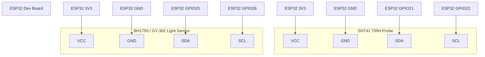
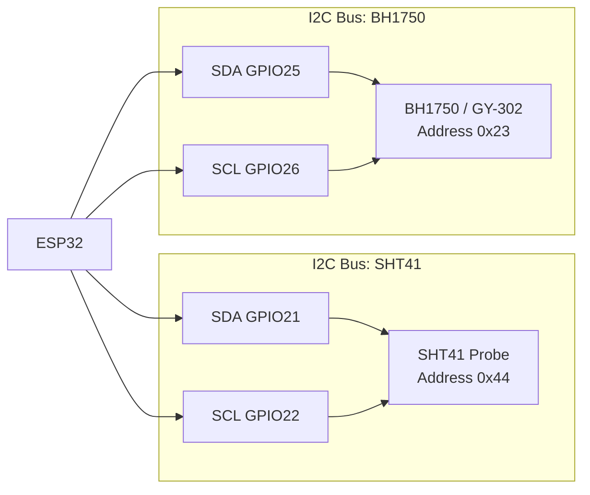

# Shroom Box Automation — Wiring

## ESP32 Pinout Plan

| Device | ESP32 Pin | Signal |
|---|---:|---|
| SHT41 Probe | 3V3 | VCC |
| SHT41 Probe | GND | GND |
| SHT41 Probe | GPIO21 | SDA |
| SHT41 Probe | GPIO22 | SCL |
| BH1750 / GY-302 | 3V3 | VCC |
| BH1750 / GY-302 | GND | GND |
| BH1750 / GY-302 | GPIO25 | SDA |
| BH1750 / GY-302 | GPIO26 | SCL |

## Wiring Diagram

## I2C Bus Layout

## Physical Notes

- Both sensors should be powered from 3.3V.
- Avoid placing the SHT41 probe directly in the humidifier mist stream.
- Place the SHT41 probe in the air volume, shielded from direct droplets.
- Place the BH1750 so it sees the box light, but is protected from condensation.
- Use short Dupont wires where possible.
- If readings become unstable, reduce I2C frequency or improve wiring.
